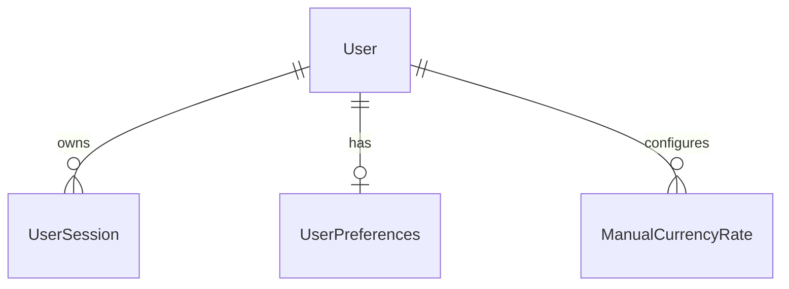

# ms-users — domain

Aggregates, value objects, invariants and schema. Endpoints: `API.md`. Messaging: `EVENTS.md`.
Shared VOs (`UserId`): parent `.ai/references/APP_STRUCTURE.md`.

## Aggregates

| Aggregate | Root entity | Owned entities / VOs | Repository | Key invariant |
|---|---|---|---|---|
| User | `User` | — | `UserRepository` | Unique lowercase email; BCrypt password hash |
| UserSession | `UserSession` | `DeviceLabel`, `InactivityPolicy` | `UserSessionRepository` | Keyed by `RefreshTokenId` (UUID); tracks device, `rememberMe`, `lastSeenAt`, `revoked` |
| UserPreferences | `UserPreferences` | — | `UserPreferencesRepository` | One per user; stores `maxIdleMinutes`, `timezone`, primary/secondary currency, formatting choices |
| ManualCurrencyRate | `ManualCurrencyRate` | — | `ManualCurrencyRateRepository` | Per-user manual FX conversion rate for non-ARS/non-USD currencies; positive `ratePerArs` |

## Value objects

| VO | What it wraps | Validation it enforces |
|---|---|---|
| `RefreshTokenId` | UUID refresh token identifier | Non-null UUID string |
| `DeviceLabel` | User-agent / device description string | Sanitized string representation |
| `InactivityPolicy` | `maxIdleMinutes` integer | Positive idle minutes ceiling |
| `RefreshTokenClaims` | Parsed token payload claims | Claims contain valid sub and type `"refresh"` |

## Domain services

| Service | The single decision it owns |
|---|---|
| `AuthenticationProviderGatewayImpl` | Authenticates email/password credentials and validates active session state |
| `PasswordHashGatewayImpl` | Encapsulates BCrypt password hashing and verification |

## ERD

## Schema `users`

| Migration | What it adds |
|---|---|
| V1 | `users` table (`email` UNIQUE, `password`, names, timestamps) |
| V2 | `outbox_event` table for transactional event publishing |
| V3 | `user_sessions` table (`refresh_token_id` UNIQUE UUID, device, `last_seen_at`, `revoked`) |
| V4 | `user_preferences` table (`max_idle_minutes`, `primary_currency`, etc.) |
| V5 | `manual_currency_rates` table (`rate_per_ars`, UNIQUE on `(user_id, currency)`) |
